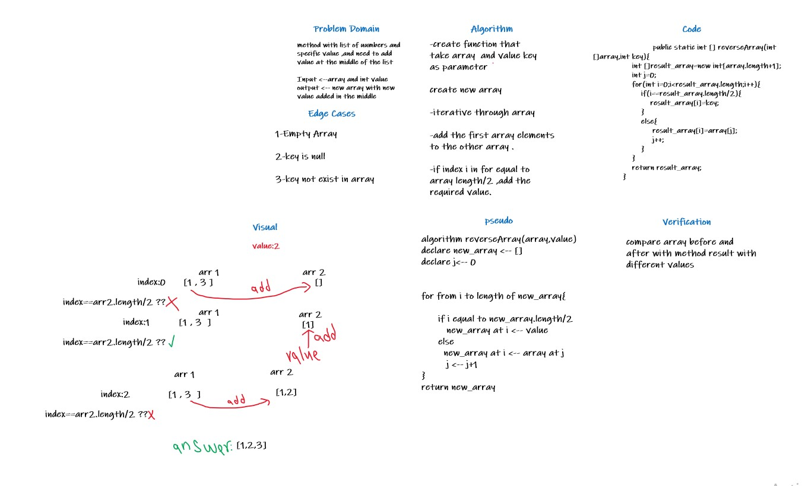

# Insert to Middle of an Array
Challenge have a method,that take array and value
as parameters ,and add value in middle of array.

## Whiteboard Process

## Approach & Efficiency
1-first define the problem domain
2-pseudo
3-draw visual in how it works
4-write algorithm
5 write code
6-verification
7-edge cases