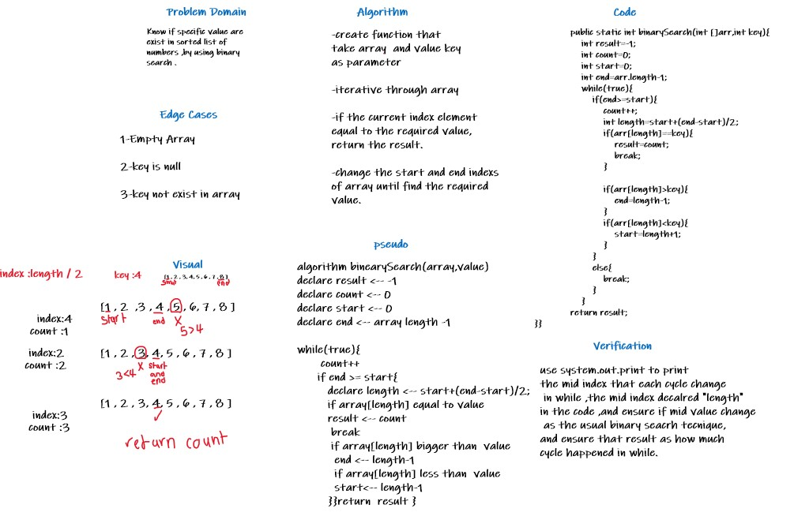

# Binary Search of Sorted Array
method to find if the inserted value exists in 
array using binary search .

## Whiteboard Process

## Approach & Efficiency
-first ,write the code in java compiler online 
-ensure the code work as required
-step by step ,wrote the required 
instructions in whiteboard