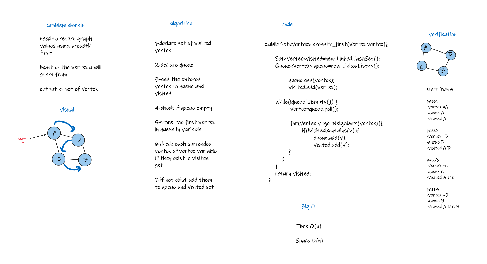

# Challenge Summary
need to return graph values using breadth first

## Whiteboard Process

## Approach & Efficiency
Time O(n)

space O(n)
## Solution
How run ?

1-call the graph class 

2-add vertices to the graph

3-connect them using add edges

4-now call the breath first method 

5-pass in it the vertex u want to start from

example ?

u added A C D B , A->C,A->D,C->B,D->B 

pass 1 
"A" will add to queue and visited 

pass 2
"A " will delete from queue
"D" will add to queue and visited 

pass 3
"D " will delete from queue
"C" will add to queue and visited 

pass 4
"C " will delete from queue
"B" will add to queue and visited 
