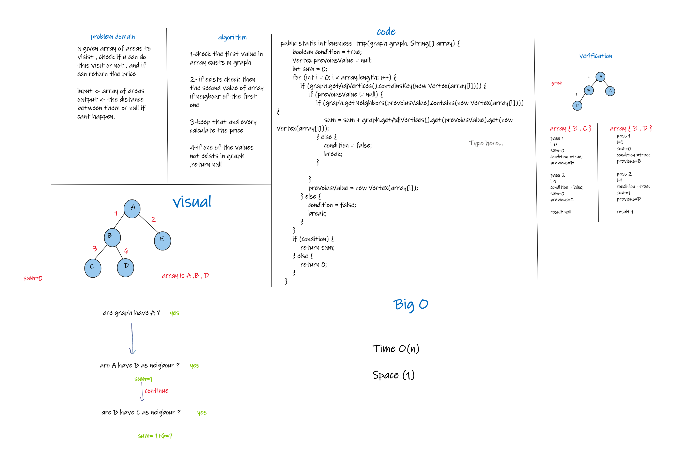

# Challenge Summary
u given array of areas to visist , check if u can do this visit or not ,
and if can return the price

## Whiteboard Process

## Approach & Efficiency
Time O(n)

space O(1)

## Solution
#### How to run the code ?

1- call graph class and

2- add nodes to it 

3-connect the nodes to each other 

4-make an array of string , that have values exists in graph class

5-put the graph and array in busniess trip method 

#### example 

graph A -> B , B -> C , B -> D 

array A , B , C 

in first pass will check the first value of array "A" if exists in graph class

if exists continue the loop , if not return null

then check if B neigbour of A  , if that add the weight of them to sum 
variable

do the same for C , and add the sum of B and C