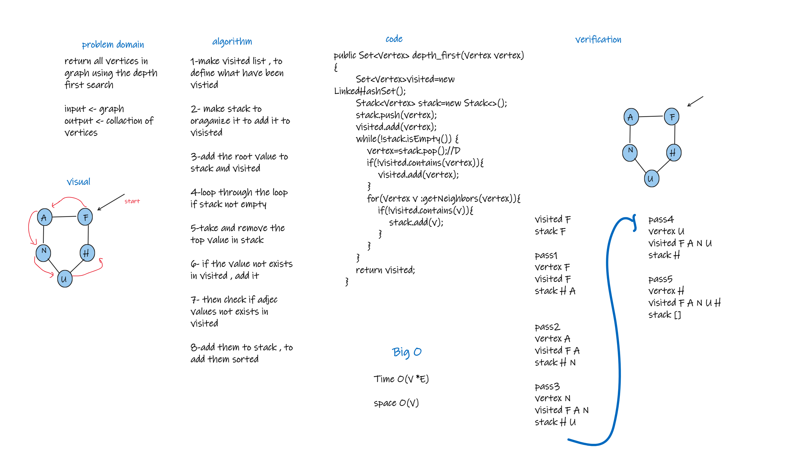

# Depth First Traversal
return all vertices in graph using the depth first search

## Challenge
start return the vertices of graph from the root , then return the 
left side then the right side.

## Approach & Efficiency
Time O(V *E)

space O(V)
## Solution

## Requirements
I complelete the following :

1. Write unit tests
 
2.Follow the template for a well-formatted README

3.Submit the assignment following these instructions