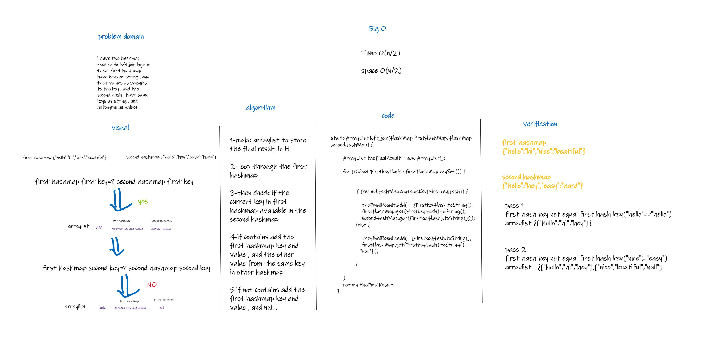

# Hashmap LEFT JOIN
this codechallenge for using left join logic in two hashmap 
## Challenge
u have two hashmap ,in first hashmap,each index have key as string , 
and the value as Synonyms in string of the key.

and the other hashmap each index have key as string , and the value
as Antonyms of string key.

## Approach & Efficiency
Time O(n/2)

Space O(n/2)
## Solution

