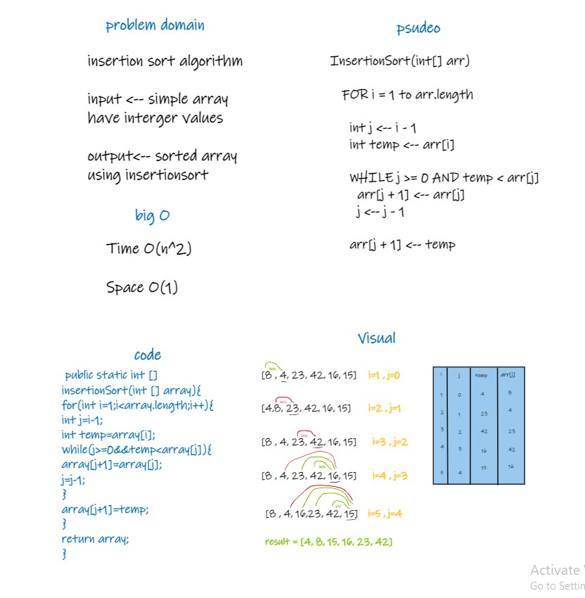

# Challenge Summary
step by step how insertion sort code algorithm works.
## Whiteboard Process


## Approach & Efficiency
Time O(n^2)

Space O(1)
## Solution
```
 public static int [] insertionSort(int [] array){
for(int i=1;i<array.length;i++){
int j=i-1;
int temp=array[i];
while(j>=0&&temp<array[j]){
array[j+1]=array[j];
j=j-1;
}
array[j+1]=temp;
}
return array;
} 
```