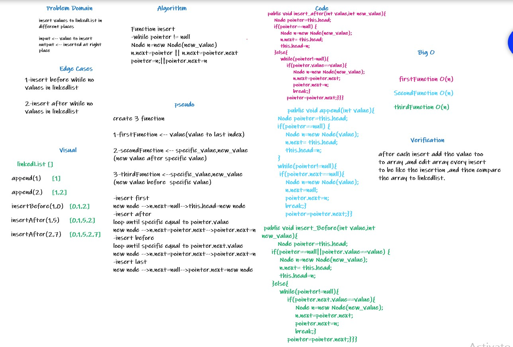

# summary
challenge for insert values at different indexes
at linked-list

# Description 
there three function to add values to linked-list
first one to add values to last index
second one to add values before specific value
last one to add values after specific values.

# whiteboard

# Approach & Efficiency
reduce time complexity of each function
.time complexity for all functions was O(n)

# code
[link](https://github.com/MotasemZaidAlkilani/data-structures-and-algorithms/blob/main/linked-list-insertions/app/src/main/java/linked/list/insertions/LinkedList.java)
