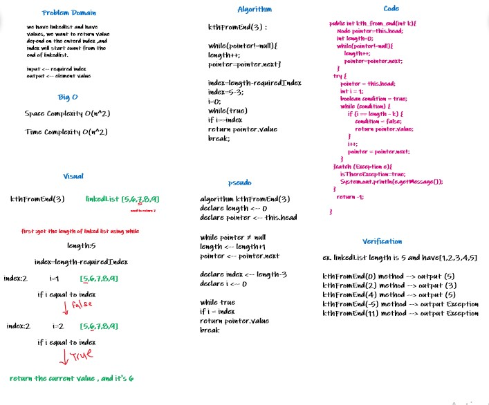

# Challenge Summary
challenge getting linkedlist value by
entered index . index begin from the end.

## Whiteboard Process

## Approach & Efficiency
1-problem domain
2-visual
3-algorithm
4-psuedo
5-code
6-verification
7-Big O
-Time Complexity O(n^2)
-Space Complexity O(n^2)

## Solution
to run the code :
1-call the linked list class
2-insert the values to linkedlist by
insert method
3-call the kthFromEnd method ,and enter 
the required element index to return 
its value.