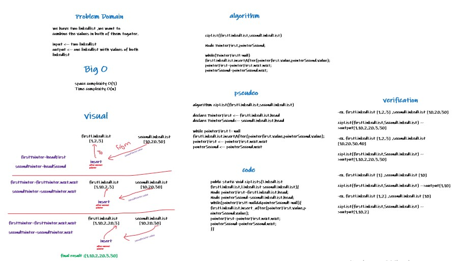

# Challenge Summary
challenge for make method ,that take two linkedList as 
parameters ,and combine theirs values on one of them.

## Whiteboard Process

## Approach & Efficiency
space complexity O(1)

Time complexity O(n)

## Solution
to run the code , u need to do the following:

1-call two linkedList classes

2-insert the same number of values to each one,using insert method

3-call zipList method and put the first and the second linklists

4-values will combine on the first parameter which is  first linkedlist

5-use toString on first linkedlist to see the result.