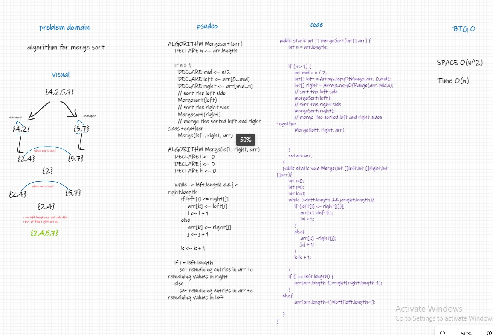
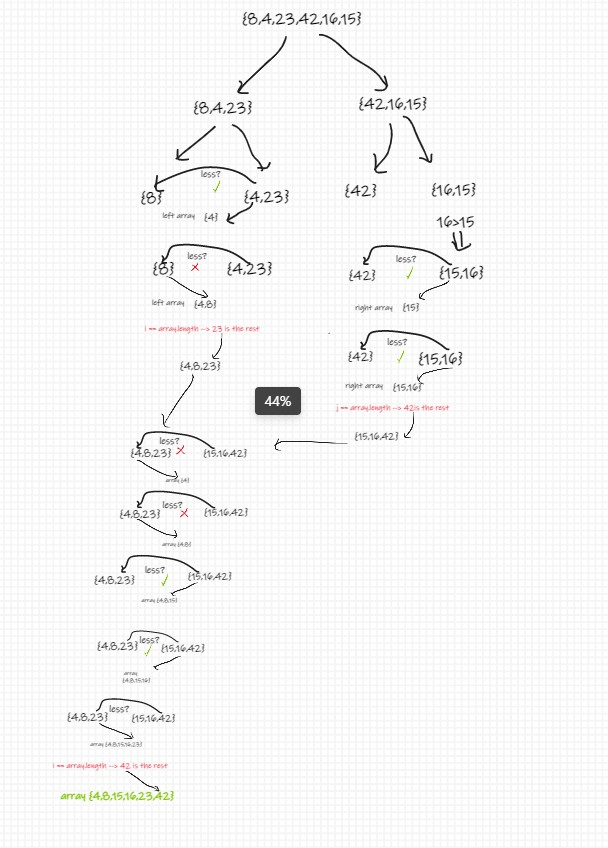

# Challenge Summary
algorithm for merge sort
# Whiteboard Process

## Approach & Efficiency
space O(n^2)

time O(n)
## blog 

## Solution
```
public static int [] mergeSort(int[] arr) {
int n = arr.length;


        if (n > 1) {
            int mid = n / 2;
            int[] left = Arrays.copyOfRange(arr, 0,mid);
            int[] right = Arrays.copyOfRange(arr, mid,n);
            // sort the left side
            mergeSort(left);
            // sort the right side
            mergeSort(right);
            // merge the sorted left and right sides together
            Merge(left, right, arr);


        }
        return arr;
    }
    public static void Merge(int []left,int []right,int []arr){
        int i=0;
        int j=0;
        int k=0;
        while (i<left.length && j<right.length){
            if (left[i] <= right[j]){
                arr[k] =left[i];
                i=i + 1;
            }
            else{
                arr[k] =right[j];
                j=j + 1;
            }
            k=k + 1;

        }
        if (i == left.length) {
            arr[arr.length-1]=right[right.length-1];
        }
    else{
            arr[arr.length-1]=left[left.length-1];

    }
}
```