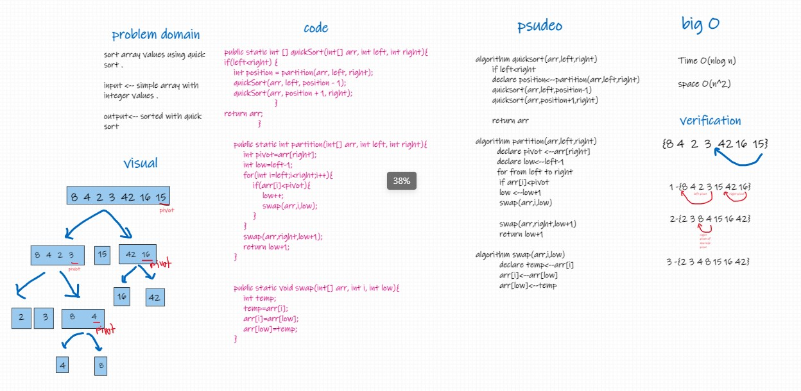

# Challenge Summary
explain the algorithm for quick sort 

## Whiteboard Process

## Approach & Efficiency
Time O(nlog n)

space O(n^2)
## Solution
1-take the right value on array and split the array
depend to two array depend on the value of its first

2-before split we sorted it and put the pivot value between 
the splited array

2-do same thing for the left and right splited array 

3- do this until stay in splited array two value