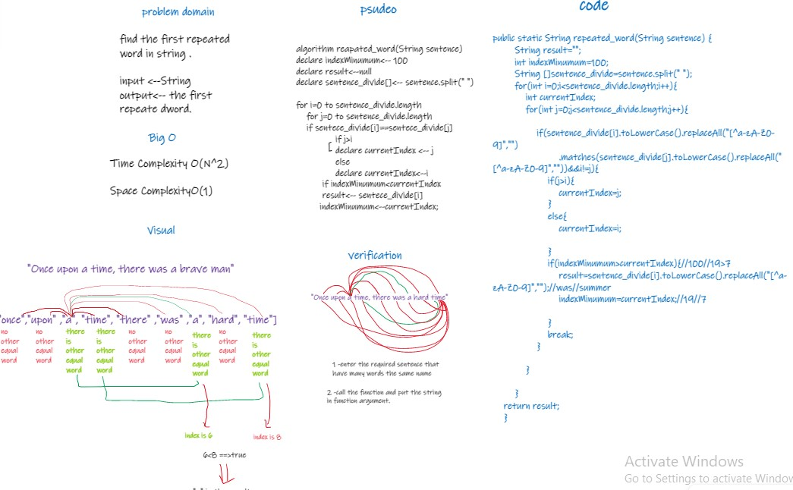

# Challenge Summary
challenge to find the first repeated word in string. 
## Whiteboard Process

## Approach & Efficiency
Time O(n^2)

Space O(1)
## Solution
How to run the code :

1-call the repeate_word() function 

2-put the required string as argument in function.

3-print the function 

_______________
when run the code :

1-the function will make array of string 

2-put each word in index 

3-will be there two loops , to check each word with other words. 

4-function will return the first repeated word , which the word equal will be less index .
