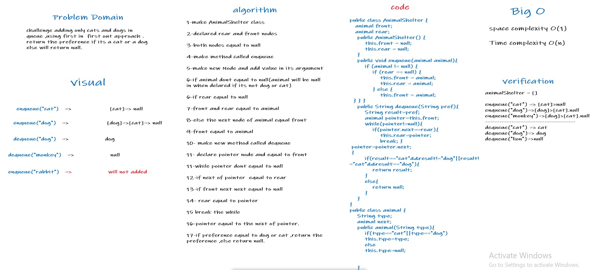

# Challenge Summary
challenge adding only cats and dogs in queue ,using first in  
first out approach . return the preference if its a cat or a dog 
else will return null.
## Whiteboard Process

## Approach & Efficiency

Time Complexity O(n)

Space Complexity O(1)

## Solution

1-call an instance from animalShelter class

2-use enqueue method 3 times on instance ,in put those values  in 
each argument "cat","dog","lion"

3-use dequeue method 2 times on instance ,in put those values in
arguments 

"cat" will return cat

"monkey" will return null

## code 

[//]: # (package stack.queue.animal.shelter;)

[//]: # (public class AnimalShelter {)

[//]: # (animal front;)

[//]: # (animal rear;)

    public AnimalShelter() {
        this.front = null;
        this.rear = null;
    }

    public void enqueue(animal animal){
        if (animal != null) {

            if (rear == null) {
                this.front = animal;
                this.rear = animal;
            } else {

                this.front = animal;
            }
        }
    }
    public String dequeue(String pref){
        String result=pref;
        animal pointer=this.front;
        while(pointer!=null){
            if(pointer.next==rear){
                this.rear=pointer;
                break;
            }
            pointer=pointer.next;

    }
        if(result=="cat"&&result!="dog"||result!="cat"&&result=="dog"){
            return result;
        }
        else{
            return null;
        }
    }

[//]: # (public class animal {)

[//]: # (String type;)

[//]: # (animal next;)

[//]: # (public animal&#40;String type&#41;{)

[//]: # (if&#40;type=="cat"||type=="dog"&#41;)

[//]: # (this.type=type;)

[//]: # (else)

[//]: # (this.type=null;)

[//]: # ()
[//]: # ()
[//]: # (    })

[//]: # ()
[//]: # (})

