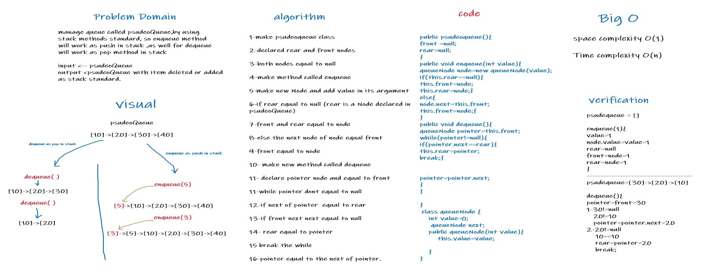

# Challenge Summary
challenge for add and delete from queue using stack methods standard
(push,pop standard)

## Whiteboard Process

## Approach & Efficiency
Time complexity O(n)

Space complexity O(1)
## Solution
**to add to queue nodes ,do the following:**

1-make instance of psudeoQueue.

2-call enqueue method from instance of psudeoQueue. 

3-pass int value in enqueue argument.

**to delete nodes from queue ,do the following:**

1-make instance of psudeoQueue.

2- call dequeue method from instance of psudeoQueue.

