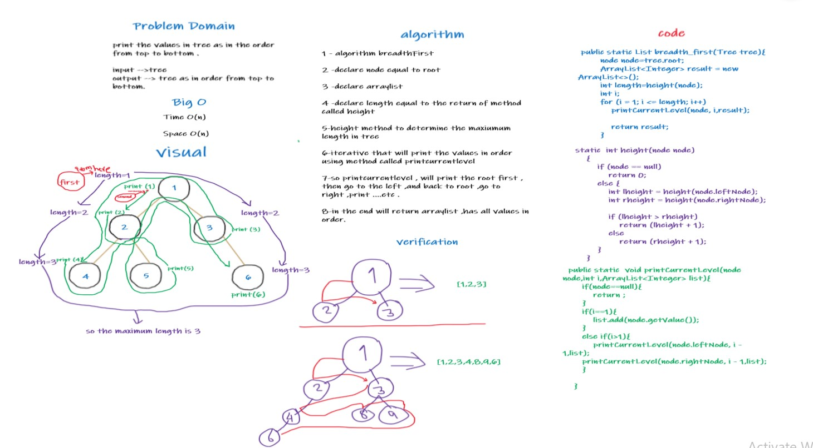

# Challenge Summary
we have tree with values inside it , we need to get and print 
the values in breadth first ,like in order from top to bottom.

## Whiteboard Process

## Approach & Efficiency
Time O(n)

Space O(n)
## Solution
1-call the tree class 

2-add values to the tree 

3-call the breadthFirst function and put the tree as argument.

## code

public static List breadth_first(Tree tree){

node node=tree.root;

ArrayList<Integer> result = new 

ArrayList<>();

int length=height(node);

int i;

for (i = 1; i <= length; i++)

printCurrentLevel(node, i,result);
            return result}

        
public static  void printCurrentLevel(node node,int i,ArrayList<Integer> list){

if(node==null){

return ;

}
if(i==1){

list.add(node.getValue());

}

else if(i>1){

printCurrentLevel(node.leftNode, i - 1,list);

printCurrentLevel(node.rightNode, i - 1,list);
}}

    

static  int height(node node)
{

if (node == null)

return 0;

else {

int lheight = height(node.leftNode);

int rheight = height(node.rightNode);
            
if (lheight > rheight)
                
return (lheight + 1);
           
 else
              
  return (rheight + 1);
        }
    }