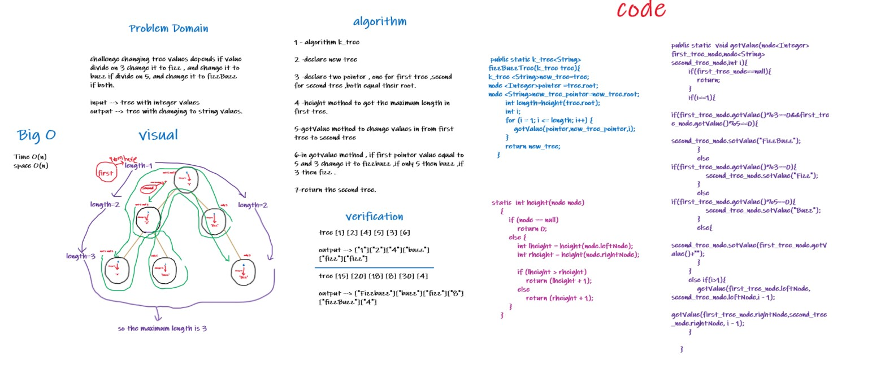

# Challenge Summary
`challenge changing tree values depends if value
divide on 3 change it to fizz , and change it to
buzz if divide on 5, and change it to fizzBuzz
if both.`

## Whiteboard Process


## Approach & Efficiency
time O(n)

space O(n)
## Solution

1-declare k_tree class

2-add values to it 

3- call the method fizzBuzz ,and put the tree as
argument .

4-to know the result , the return result from 
the method ,put for example the root , and left and the right 
of the root .

## code 
```
public static k_tree<String> fizzBuzzTree(k_tree tree){
k_tree <String>new_tree=tree;
node <Integer>pointer =tree.root;
node <String>new_tree_pointer=new_tree.root;
int length=height(tree.root);
int i;
for (i = 1; i <= length; i++) {
getValue(pointer,new_tree_pointer,i);
}
return new_tree;
}
public static  void getValue(node<Integer> first_tree_node,node<String> second_tree_node,int i){
if(first_tree_node==null){
return;
}
if(i==1){
if(first_tree_node.getValue()%3==0&&first_tree_node.getValue()%5==0){
second_tree_node.setValue("FizzBuzz");
}
else if(first_tree_node.getValue()%3==0){
second_tree_node.setValue("Fizz");
}
else if(first_tree_node.getValue()%5==0){
second_tree_node.setValue("Buzz");
}
else{
second_tree_node.setValue(first_tree_node.getValue()+"");
}
}
else if(i>1){
getValue(first_tree_node.leftNode, second_tree_node.leftNode,i - 1);
getValue(first_tree_node.rightNode,second_tree_node.rightNode, i - 1);
}

    }
    static  int height(node node)
    {
        if (node == null)
            return 0;
        else {
            int lheight = height(node.leftNode);
            int rheight = height(node.rightNode);

            if (lheight > rheight)
                return (lheight + 1);
            else
                return (rheight + 1);
        }
    }
```