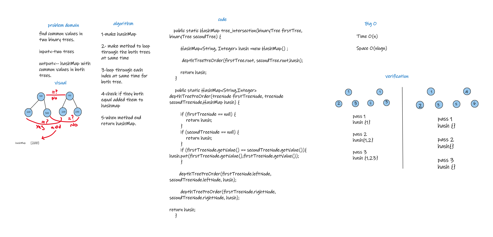

# Challenge Summary
find the common values between two binary tree
## Whiteboard Process

## Approach & Efficiency
Time O(n)

space o(n logn)

## Solution
How to run the code :

1-make two tree , and add the same size of values in it 

2- call the method tree_intersection

3-put the both tree in argument 

How code working :
 
1- when u put the two tree in method argument 

2- the method will take them , and loop at same index for both trees 

3-then will check if they equal 

4- if they equal will add it to hashMap 

5- the method when end will return set of values inserted in hashMap