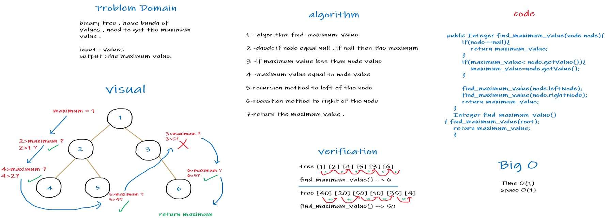

# Challenge Summary
binary tree ,and have bunch of values , need to get the maximum
value in it.
## Whiteboard Process

## Approach & Efficiency
Time O(1)

Space O(1)
## Solution
1-add values to binary tree ex : 

tree.root=new node(1); // first value which is the root

tree.root.leftNode=new node(2); // second value which the left of the root

2-after add whatever u want in tree , call the method to 

find the maximum. the method called find_maximum_value() .